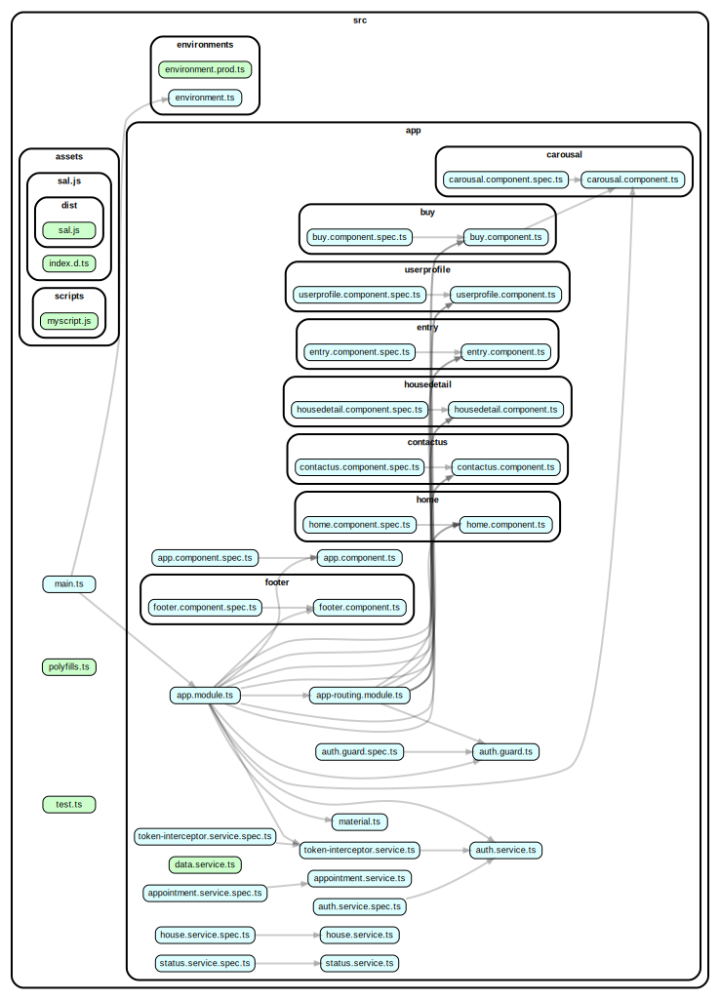

PROPERTY AQUISITION WEBSITE...
# Real Estate Website - House & Apartment Selling and Renting Platform

- This project was created to simplify communication between house sellers and buyers.
- The frontend was built using the Angular framework, with Node.js for the server and MongoDB for the database.
- Why MongoDB? Since we need to query all house data at once, MongoDB offers faster queries by keeping data in one place. Using an RDBMS would require costly join operations.
- I integrated the Mapbox API for geolocation, allowing us to display property locations with pins on the map.

## Key Features

- Users can list their properties for sale or rent.
- Buyers can schedule appointments based on the seller's availability.
- Sellers can then approve or reject appointments.
- Search functionality includes filtering by location, price, amenities, and the number of bedrooms, kitchens, and bathrooms.
- User interface design: I tried to focuse on creating a user-friendly layout for showcasing property details. We researched multiple real estate websites for inspiration, combining the best ideas to develop our unique UI.
- For location data, I used a geolocation API.

## Angular Component Structure

